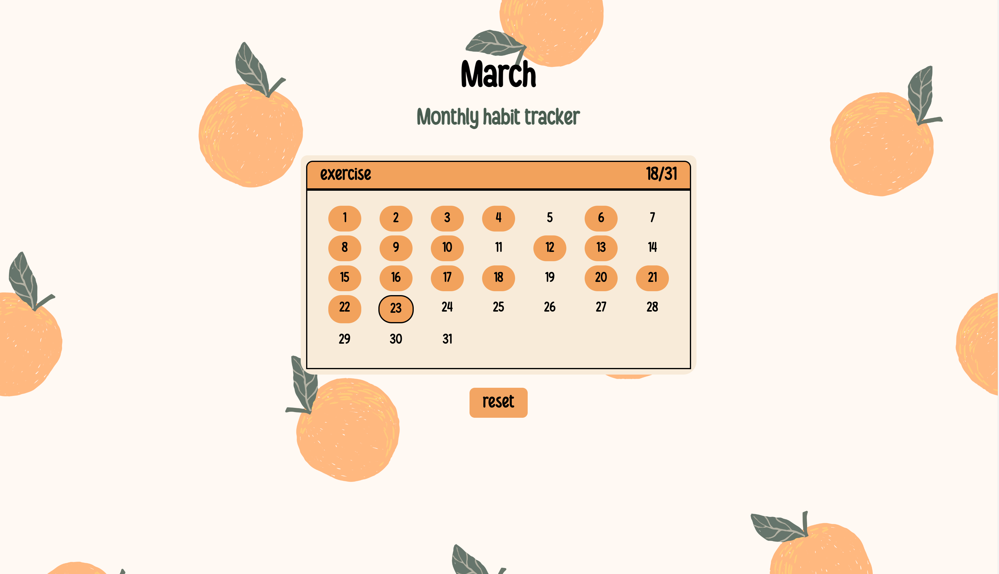

# Habit Tracker :orange:

This is a simple and interactive monthly habit tracker build with HTML, CSS and JavaScript. This application allows users to track daily habits, visualise their progress, and persist data using localStorage.

---

## Features

- Dynamic calendar based on the current month
- Click on days to mark habits as completed
- Toggle completion state (complete <-> incomplete)
- Persistent data using localStorage
- Custom habit title (editable by user)
- Progress tracker (e.g. 5/30 days completed)
- Prevents selecting future dates
- Reset button to clear all progress

---

## Technologies used

- HTML
- CSS 
- JavaScript
- localStorage API

---

## Challenges

I faced a fair few challenges during this build, namely:
- Preventing interactions with future dates
- Handling edge cases such as different month lengths
- Structuring the calendar grid dynamically using nested loops

---

## What I learned

- A deeper understanding of the relationship between localStorage and the DOM and how keeping them in sync is essential for a consistent user experience
- Using localStorage to persist user data across page refreshes which allows the application to maintain state
- Creating and using keys (month-day-year) to store and retrieve specific data for each day
- Breaking down a complex problem, such as building a calendar, into smaller and more manageable steps

---

## Future improvements

There are endless things I'd love to build on with this project, but just to name a few:
- Add ability to track multiple habits
- Add logic for leap years 👀
- Add custom styling options or colour themes
- Weekly or yearly analytics
- Improve mobile responsiveness

---

## How to run the project
1. Clone the repository: https://github.com/RheasaraGravestock/HabitTracker.git
2. Open the project folder
3. Open the index.html in your browser by: -Double clicking or -Right click -> 'Open with' -> your browser
4. The application will load in your browser -> Happy tracking!

---

## Screenshot of the application

---

## Live demo

[Click to view project](https://rheasaragravestock.github.io/HabitTracker/)
